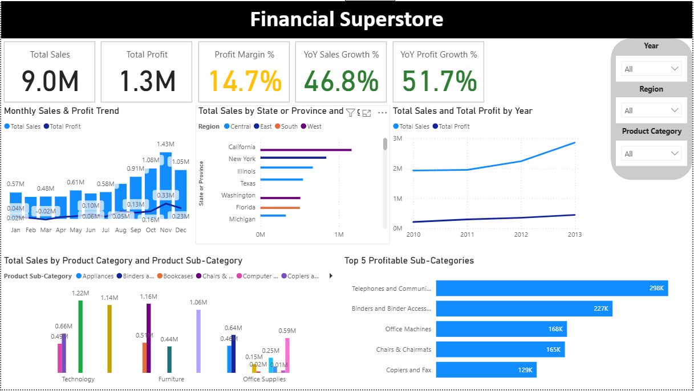
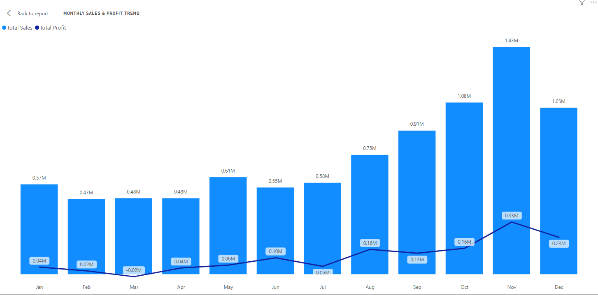
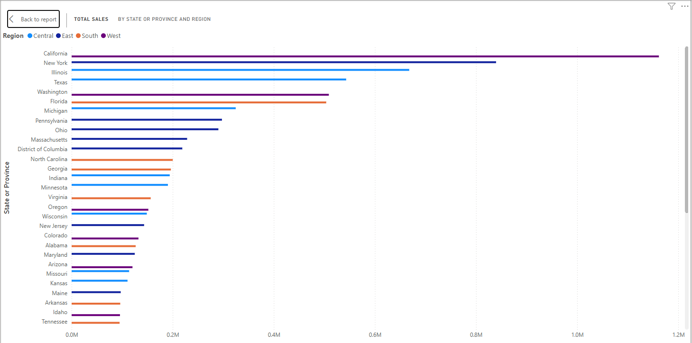
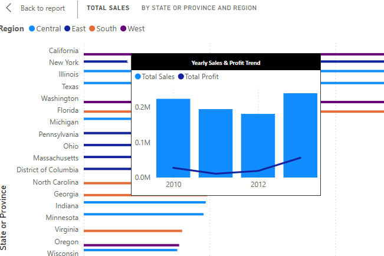
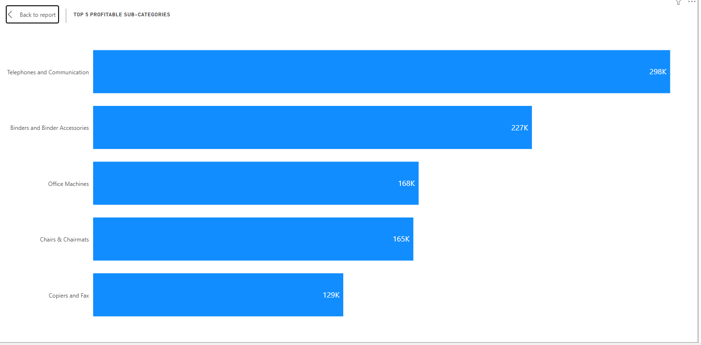
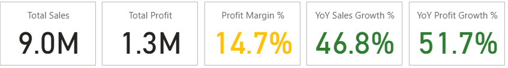

# 📈 Superstore Sales Performance Dashboard

A Power BI dashboard built using the famous **Superstore Dataset**.  
It highlights **Sales Performance, Profitability, Regional Trends, Product Insights**, and showcases **interactive visuals, tooltips, and conditional formatting**.

---

## 📌 Project Overview
This project demonstrates end-to-end data analysis:
- ✅ Data cleaning and transformation in **Power Query**
- ✅ Creation of a **Date Table** and **KPI measures** using **DAX**
- ✅ Building an interactive dashboard with **slicers and tooltips**
- ✅ Applying **conditional formatting** to KPI cards for better insights  

**Goal:** Provide managers with an **at-a-glance view** of sales performance and profit drivers.

---

## 🔑 Key Features

### 📊 KPIs for:
- **Total Sales**
- **Total Profit**
- **Profit Margin %**
- **YoY Sales Growth %**
- **YoY Profit Growth %**

---

### 📈 Visuals include:
- Monthly **Sales & Profit Trend**
- **Total Sales by State & Region**
- **Top 5 Profitable Sub-Categories**
- **Product Category vs. Sub-Category** breakdown
- **Yearly Sales vs. Profit Trend**

---

### 🔎 Interactive Slicers for:
- Year  
- Region  
- Product Category  

---

### 💡 Custom Tooltip:
- Extra insights on hover for **Sales by State & Region**

---

### 🎨 Conditional Formatting for KPI Cards:
#### **Profit Margin %**
- 🟢 **> 15%** → High Margin  
- 🟠 **10–15%** → Moderate Margin  
- 🔴 **< 10%** → Low Margin  

#### **YoY Sales Growth %**
- 🟢 **> 10%** → Healthy Growth  
- 🟠 **0–10%** → Moderate Growth  
- 🔴 **< 0%** → Decline  

#### **YoY Profit Growth %**
- 🟢 **> 8%** → Strong Growth  
- 🟠 **0–8%** → Low Growth  
- 🔴 **< 0%** → Negative Growth  

---

## 📊 Dashboard Previews

1. **Full Dashboard**  
   

2. **Monthly Sales & Profit Trend**  
   

3. **Sales by State & Region**  
   

4. **Tooltip Example**  
   

5. **Top 5 Profitable Sub-Categories**  
   

6. **KPI Cards with Conditional Formatting**  
   

---

## 📥 Download Files
- [Download Power BI Report (.pbix)](Superstore_Sales_Performance.pbix)
- [Download PDF Version](Superstore_Sales_Performance.pdf)

---

## 🛠 Tools Used
- **Power BI Desktop**
- **Power Query** → Data cleaning & transformations
- **DAX (Data Analysis Expressions)** → KPI calculations
- **Superstore Dataset (Tableau Sample Data)**

---

## 🚀 How to Use
1. Download the `.pbix` file from the link above.  
2. Open it in **Power BI Desktop**.  
3. Use slicers (**Year**, **Region**, **Product Category**) to filter insights.  
4. Hover over charts to see **custom tooltips**.  
5. KPI cards will **change color dynamically** based on performance.

---

## 💡 Insights
- **Technology products** dominate sales but margins vary.
- Certain sub-categories (e.g., **Phones** & **Binders**) drive profitability.
- Some regions underperform and need **strategic focus**.
- **YoY growth trends** reveal both seasonal and annual patterns.

---

✨ Created as a **practice project** to showcase **Power BI skills** in:
- Data modeling  
- Dashboarding  
- Visual storytelling  
- Insight generation  

